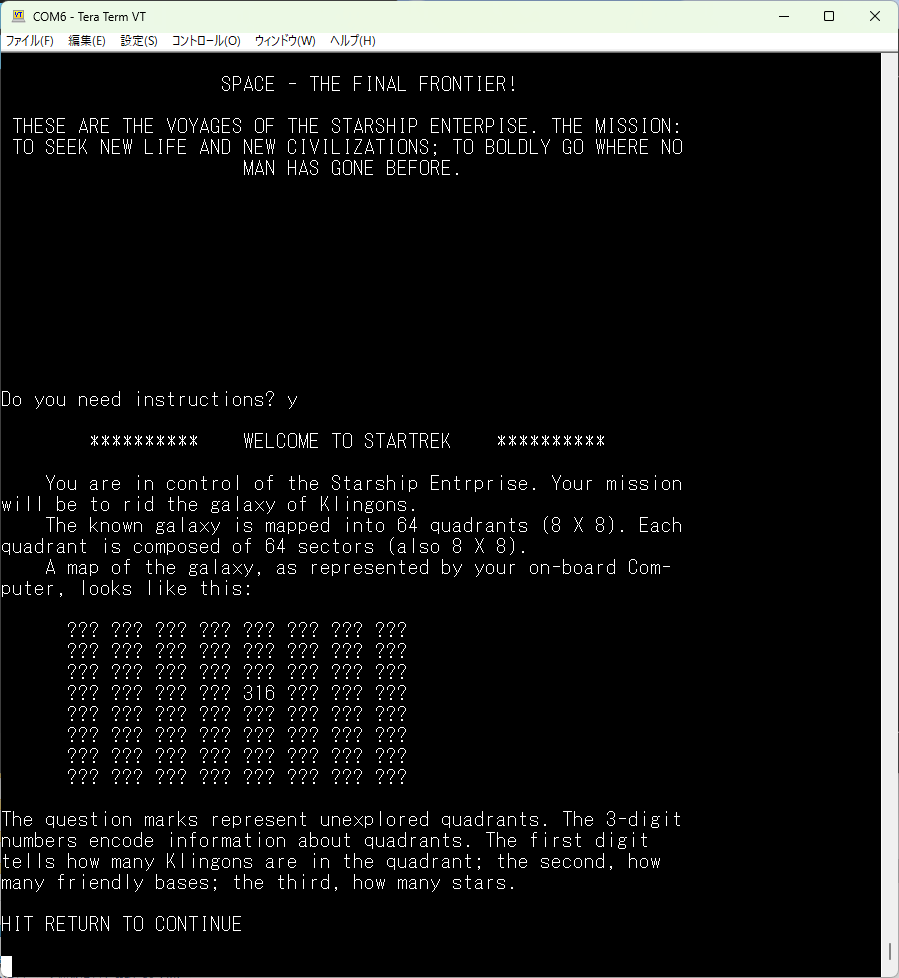
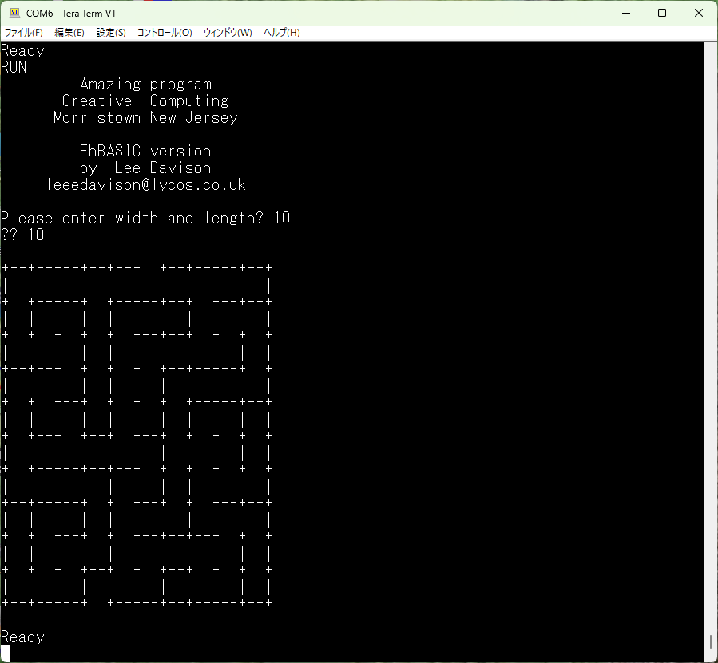

# Enhanced 6502 Basic 

 

EhBASICのバージョンは、2.22p5を使用しています。最新版は[ここ](https://mdfs.net/Software/6502/EhBasic/)です。

オリジナルは、min_mon.asmと、basic.asmの2つのファイルから構成されていますが、 
Rev2.0では、１つにまとめてあります。起動方法とメモリサイズの入力は無しで起動するように修正しました。 
 
サンプルプログラムとして、ASCIIART.BASとSTARTREK.BAS、AMAZING.BASがあります。 

ASCIIARTはレトロPC界隈では、とても有名で、今更説明の必要は無いでしょう。 
 

- STARTREK.BAS  
  BASICの代表的なゲームと言えば、スタートレックでしょう。スタートレックは数多くの派生バージョンがありますが、 
  EhBASICで動作するのは、1977年4月、W.A. バートンにより拡張されたのをベースに[Lee Davison](http://www.6502.org/users/mycorner/68k/ehbasic/examples.html)氏 
  によって2003年3月にEhBASIC用に修正されたバージョンです。 
  初期の頃のスタートレックに近いものだと思います。 
  Rev2.0で読み込めるように修正後、全ての項目を試せていないので、修正ミスでバグってる可能性があります。 
  バグがあったら、各自修正お願い致します。（他人任せモード(笑)）  

   

- AMAZING.BAS  
  2Dの迷路を作成するプログラムです。このプログラムも[Lee Davison](http://www.6502.org/users/mycorner/68k/ehbasic/examples.html)氏のサイト 
  から、拝借しました。Rev2.0で変更なしで動作しています。  

  
