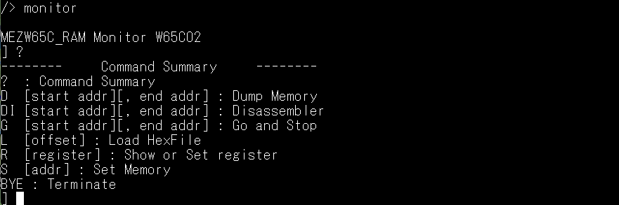

# W65C02モニター

W65C02モニターは、[@electrelic](https://x.com/electrelic)さんの[Universal Monitor](https://electrelic.com/electrelic/node/1317)がベースとなっています。 
6502用のを改修しました。基本的な操作は変わりません。 
逆アセンブルコマンドを追加し、Ｇコマンドにストプパラメータを追加しました。 
Lコマンドの詳細は、[L(oad) コマンド](https://electrelic.com/electrelic/node/1332)を参照してください。 

| コマンド | パラメータ | 内容 |補足|
|---------|-----------|------|----|
| ?  | |コマンド一覧表示|
D | [start addr][, end addr] | メモリの内容をダンプする
DI | [start addr][, end addr] | メモリ内容を逆アセンブルする
G | [start addr][, stop addr] | 指定したアドレスから実行する
　| |ストップアドレスで停止する
L | [offset] | ヘキサファイルをロードする
R | [register] | レジスタ一覧表示（パラメータ無しのとき）
　|| パラメータにレジスタ指定で、内容変更
S | [addr] | 指定アドレスのメモリ内容変更
　||ー、＋キーでアドレスの進退
BYE || モニターを終了する

