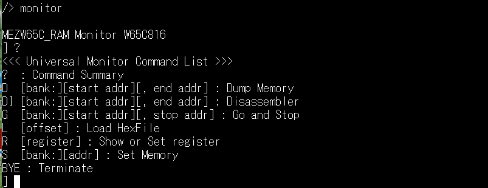

# W65C816モニター

W65C816モニターは、[@electrelic](https://x.com/electrelic)さんの[Universal Monitor](https://electrelic.com/electrelic/node/1317)がベースとなっています。 
6502用のをW65C816用に改修しました。基本的な操作は変わりません。 
逆アセンブルコマンドを追加し、Ｇコマンドにsutoppuストップパラメータを追加しました。 
Lコマンドの詳細は、[L(oad) コマンド](https://electrelic.com/electrelic/node/1332)を参照してください。 
 
逆アセンブラのソースは[andrew-jacobs](https://github.com/andrew-jacobs)さんの[w65c816sxb-hacker](https://github.com/andrew-jacobs/w65c816sxb-hacker)から逆アセンブル部分を利用しています。 
スタック操作命令のPEI, PEA, PER が正しく表示されなかったので、修正してあります。 

| コマンド | パラメータ | 内容 |補足|
|---------|-----------|------|----|
| ?  | |コマンド一覧表示|
D | [bank:][start addr][, end addr] | メモリの内容をダンプする|バンクは０～７
DI | [bank:][start addr][, end addr] | メモリ内容を逆アセンブルする|バンクは０～７
G | [bank:][start addr][, stop addr] | 指定したアドレスから実行する|バンクは０～７
　| |ストップアドレスで停止する
L | [offset] | ヘキサファイルをロードする
R | [register] | レジスタ一覧表示（パラメータ無しのとき）
　|| パラメータにレジスタ指定で、内容変更
S | [bank:][addr] | 指定アドレスのメモリ内容変更|バンクは０～７
　||ー、＋キーでアドレスの進退
BYE || モニターを終了する
 

