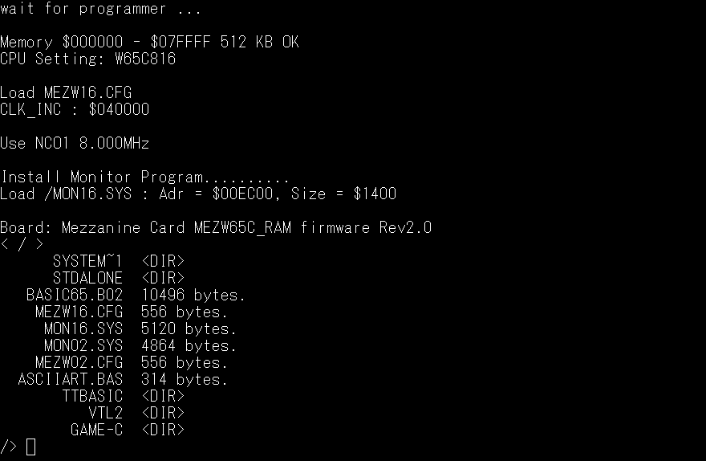
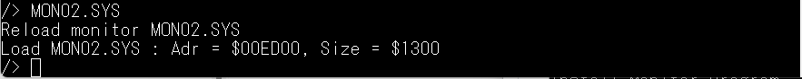
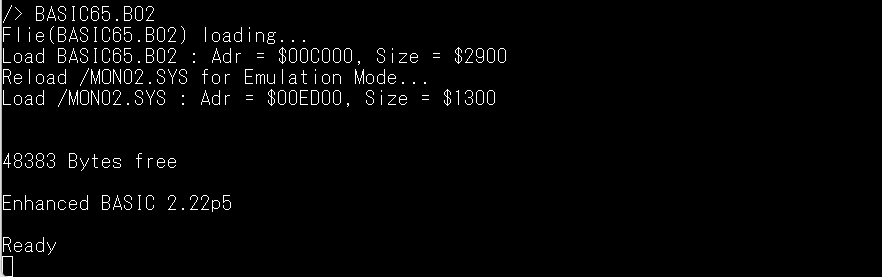
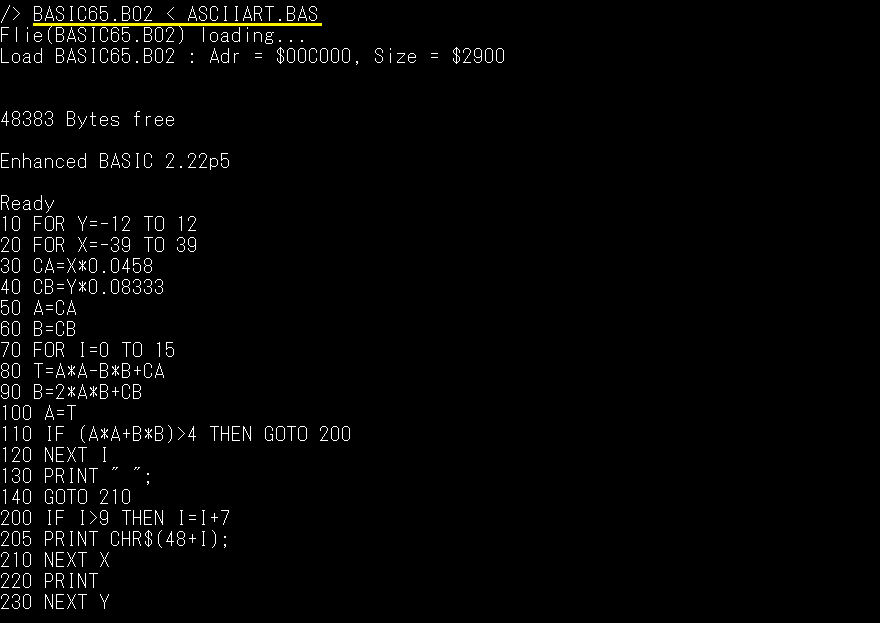
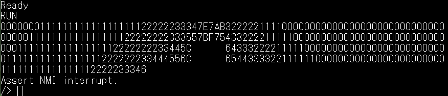

工事中＜Under construction＞
# MEZW65C_RAM ファームウェア Rev2.0

- [ファームウェアRev2.0コマンド](https://github.com/akih-san/MEZW65C_RAM-Rev2.0/blob/main/src) 
- [W65C816モニターコマンド](https://github.com/akih-san/MEZW65C_RAM-Rev2.0/blob/main/mon16) 
- [W65C02モニターコマンド](https://github.com/akih-san/MEZW65C_RAM-Rev2.0/blob/main/mon02) 
- [EhBASIC](https://github.com/akih-san/MEZW65C_RAM-Rev2.0/tree/main/basic/BIOSCALL) 
- [VTL2](https://github.com/akih-san/MEZW65C_RAM-Rev2.0/tree/main/vtl2) 
- [豊四季タイニーベーシック](https://github.com/akih-san/MEZW65C_RAM-Rev2.0/tree/main/ttbasic) 
- [GAMEインタープリタ](https://github.com/akih-san/MEZW65C_RAM-Rev2.0/tree/main/GAME-C) 
- [MEZW65C_RAMピンアサイン](https://github.com/akih-san/MEZW65C_RAM/blob/main/MEZW65C_RAM%E3%83%94%E3%83%B3%E3%82%A2%E3%82%B5%E3%82%A4%E3%83%B3.pdf)
- [MEZW65C_RAM図面](https://github.com/akih-san/MEZW65C_RAM/blob/main/MEZW65C_RAM%E5%9B%B3%E9%9D%A2.pdf)
- [MEZW65C_RAM部品表](https://github.com/akih-san/MEZW65C_RAM/blob/main/MEZW65C_RAM%E9%83%A8%E5%93%81%E8%A1%A8.pdf)
- [W65c02 W65c816比較](https://github.com/akih-san/MEZW65C_RAM/blob/main/65c02%2065c816%E6%AF%94%E8%BC%83.pdf)
- [ガーバーデータ](https://github.com/akih-san/MEZW65C_RAM/tree/main/w65c_Rev1.2_Gerber)
- [μＳＤカードの作成](https://github.com/akih-san/MEZW65C_RAM-Rev2.0/tree/main/DISKS)
  
# Rev2.0を作成した経緯

2024年8月にRev1.2を公開しましたが、ソフトウェアがW65C02用のユニバーサルモニタと 
Eh-BASIC、それから、W65C816用のネイティブモニタの３つしかありませんでした。 
そして、各ソフトを切り替えるには、リセットが必要でした。 
https://github.com/akih-san/MEZW65C_RAM 
 

当初は、レガシーＯＳの移植を検討していたのですが、W65C816を生かしたものが見当たり 
ません。せっかくW65C816が動くのですから、もう少しネイティブモードで動くものが欲しい。 
また、レガシーＯＳは、ＯＳ専用のディスクイメージが必要となり、ソフトをクロス上で 
作成しても、ディスクイメージに落とし込む作業が、ちょっと面倒な点でした。 
 
折角ＳＤカードを使うのですから、FAT32でファイルを管理して、もっと手軽に 
W65C02/W65C816用に作ったプログラムで遊びたい・・・ 
 
そんな思いで、Rev2,0のファームウェアを作成しました。 
 
# Rev2.0の特徴

Rev2.0では、クロス環境で作成したプログラムをFAT32のSDカードにコピーするだけで、 
MEZW65C_RAM上でプログラムを動作させることが出来ます。 
W65C816の機能を堪能するには十分だと思います。もちろん、W65C02でも十分に楽しむ 
ことが出来ます。 
 
## １．ファイルの管理
 
ファイル管理にfatfsを利用しています。また、階層ディレクトリにも対応しています。 

Rev2.0では、W65C02とW65C816のプログラムを管理するために、ファイルの先頭に32バイト 
のファイルヘッダを設けております。この為、Rev1.2のプログラムをRev2.0で動かすことは 
出来ません。 
ファイルヘッダは、ソースプログラムで組み込みますが、サンプルのソースがありますので、 
それを使って作成します。 
 
ファイルヘッダを持たない、生データのバイナリファイルを利用する場合は、LOADコマンド 
にLOADアドレスを指示することで、強制的にメモリ上に生データを展開することも出来ます。 

 
ファイルのwrite機能はありません。基本的にクロス環境で作成したプログラムを実行する 
ことを想定しており、MEZW65C_RAMでデータを作成し、外部にエクスポートすることは無い 
と思ってます。 
（今後、そういった状況が発生することがあれば対応を考えますが・・多分無いでしょう。） 
 

## ２．ファイル名
 
ロングファイル名には対応していません。ファイル名は8文字＋拡張子になります。Rev2.0は 
ファイルヘッダ情報でファイルを管理するため拡張子は意味を持っていません。 
視覚的な認識として、プログラマーが好きに使用することになります。 
 

 

##  ３．モニタープログラムの常駐（BIOSコールの実装）
 
BIOSコールを実装するために、モニタープログラムが常駐しています。ネイティブモニタと、 
エミュレーションモニタの２つが用意されています。W65C02使用時はエミュレーションモニタ 
が使用されます。 
 

 
W65C816使用時は、起動直後はネイティブモニタが常駐しますが、エミュレーションモニタを 
リロードすることで、W65C02のプログラムを動作させることが出来ます。 
 

 
Rev2.0は、実行させるプログラムのファイル情報でネイティブか、W65C02用かを見分けるこ 
とが出来るため、必要とあればモニターのリロードを自動で実施するので、手動でモニターを 
リロードする必要はありません。 
 

 
手動でリロードすることも出来ます。ほとんどの場合、モニタプログラムでユーザー作成のプログ 
ラムをデバッグする時に、使用することでしょう。 
 

## ４．UART入力を一時的にファイル入力に切り替える
 
EMUZ80シリーズのSBCは、BASICなどのインタープリタのプログラムをターミナル（TeraTerm等） 
のコンソール入力から流し込む形を取っています。そのスピードは、プログラムの取りこぼしを 
防ぐため、9600bpsとなっています。この為、長いプログラムの入力に時間が掛かっていました。 
Rev2.0では、プログラムを起動する際に、一時的にUART入力をファイル入力に切り替えることが 
出来ます。これによって、インタプリタ等のプログラムを高速で取り込むことが出来るように 
なっています。 
 

## ５．UART入力を115200bpsに高速化
 
プログラムをコンソールから流し込む必要が無くなったため、UARTのビットレートを115200bpsに 
引き上げています。 
 

## ６．キー入力「Ctrl+Q」によるＮＭＩ割込みのサポート
 
モニタープログラムは、キー入力「Ctrl+Q」でＮＭＩ割込みを発生させ、Rev2.0ファームウェアに 
制御を渡すことが出来ます。この機能をユーザープログラムで有効にすることが出来るので、 
ユーザープログラムを「Ctrl+Q」で中断することが出来ます。 
ただし、コンソール入出力がRev2.0と競合したり、ユーザープログラムが暴走している場合、 
デッドロック状態が発生する場合があります。この状態に陥ってしまった場合は、リセットが 
必要になります。 
 

## ７．４種類のインタプリタが動作
 
・EhBASIC（W65C02用） 
・VTL2（W65C02、W65C816） 
・豊四季タイニーベーシック（W65C02、W65C816） 
・GAMEインタプリタ（W65C02、W65C816） 
 
BASICはW65C02用のみです。（ネイティブモードで動作するBASICが見つからなかった） 
その他は、両方のモードにそれぞれプログラムを用意してあります。 
詳細については、各インタプリタのディレクトリを参照してください。 
 

# 開発環境
- Rev2.0のソースのコンパイルは、マイクロチップ社のMPLAB X IDE v6.20を使用しています。 
  - [MPLAB® X Integrated Development Environment (IDE)](https://www.microchip.com/en-us/tools-resources/develop/mplab-x-ide)
 
・WDCTools 
The Western Design Center, Inc.が提供しているアセンブラ、cコンパイラを含む統合開発環境 
https://wdc65xx.com/WDCTools 
 
・CC65 
フリーで現役の6502用Cコンパイラです。 
https://cc65.github.io/ 
 
・bin2mot.exe、mot2bin.exe 
モトローラフォーマットのヘキサファイルとバイナリファイル相互変換ツール 
ソースとバイナリファイルは、ここから入手できます。 
https://sourceforge.net/projects/bin2mot/files/ 
 
・xa (xa65) Version 2.4.1  
6502用の2 パス ポータブル クロス アセンブラです。 
https://www.floodgap.com/retrotech/xa/ 
 
・ASW,ASL 
沢山のCPUに対応したマクロアセンブラ 
http://john.ccac.rwth-aachen.de:8000/as/ 
 
・FatFsはR0.15を使用しています。 
　＜FatFs - Generic FAT Filesystem Module＞ 
　http://elm-chan.org/fsw/ff/00index_e.html 
 

# PIC18F47Q43/Q84への書き込み
・snap 
マイクロチップ社の書き込みツールです。 
 
・PICkit3 
PICkitminus書き込みソフトを用いて、書き込むことが出来ます。以下で入手できます。 
http://kair.us/projects/pickitminus/ 
 
 
PICへの書き込みツールを用いて、ヘキサファイルを書き込みます。 
書き込み用のデータは8MHz用と、4MHz用の2種類用意しました。 
 
・PIC18F47Q43 
　　- R1.2q43_8MHz.hex 
　　- R1.2q43_4MHz.hex 
 
・PIC18F47Q84 
　　- R1.2q84_8MHz.hex 
　　- R1.2q84_4MHz.hex 
 
 
# 動作周波数
 
動作周波数の設定は、src/boardsにあるソースファイルw65_bd.cで修正できます。 
9MHz以上の設定も出来ますが、動作が不安定です。11MHz以上は動作しません。 
 
（注意事項） 
アクセスタイム55nsのメモリを使用しているため、10MHz付近が限界のようです。 
W65C02Sでは、10MHzで動作しています。 
W65C816Sでは、エミュレーションモードでは10MHzで動作していますが、ネイティブ 
モードに切り替えた場合、BANK0以外では10MHzで動作しませんでした。 
 

