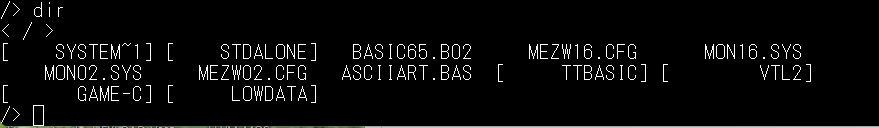

# ファームウェアRev2.0のコマンド

- コマンド一覧

| コマンド名 | 説明                                            |
|-----------|-------------------------------------------------|
|DIR        |ファイルの一覧表示（ファイル名のみ）                |
|LS 　      |ファイルの一覧表示（ファイル名とファイルサイズ表示）  |
|CD         |階層ディレクトリの移動                             |
|LOAD       |ファイルのロード                                  |
|MDUMP      |メモリのダンプ表示                                |
|MONITOR    |モニターの起動                                    |
|CSTART     |プログラムのコールドスタート                       |
|WSTART     |プログラムのウォームスタート                       |
|RETI       |ＮＭＩ割込みからの復帰                             |
|REG        |W65C02または、W65C816のレジスタ表示                |
|SHOW       |ファイル情報の表示                                |
|FLASH      |ＮＭＩ割込みしたプログラムの終了                    |
|HELP ｜ ?  | コマンド一覧の表示                                |

  

- DIR 
  ファイルの一覧を表示します。

- LS 
  ファイルとファイルサイズの一覧を表示します。

- CD 
  チェンジディレクトリ。カレントディレクトリを移動します。

- LOAD 
  ファイルのロード。ファイルヘッダ情報に従ってファイルをロードします。 
  「Ｌ＝ロードアドレス」を指定することで、Lowファイルをメモリ上に 
  ロードすることが出来ます。この指定を行うと、ファイルヘッダ情報は 
  無視されて、指定したアドレスにファイルがロードされます。 

- MDUMP 
  チェンジディレクトリ。カレントディレクトリを移動します。

- MONITOR 
  チェンジディレクトリ。カレントディレクトリを移動します。

- CSTART 
  チェンジディレクトリ。カレントディレクトリを移動します。

- WSTART 
  チェンジディレクトリ。カレントディレクトリを移動します。

- RETI 
  チェンジディレクトリ。カレントディレクトリを移動します。

- REG 
  チェンジディレクトリ。カレントディレクトリを移動します。

- SHOW 
  チェンジディレクトリ。カレントディレクトリを移動します。

- FLASH 
  チェンジディレクトリ。カレントディレクトリを移動します。

- HELP | ? 
  チェンジディレクトリ。カレントディレクトリを移動します。

