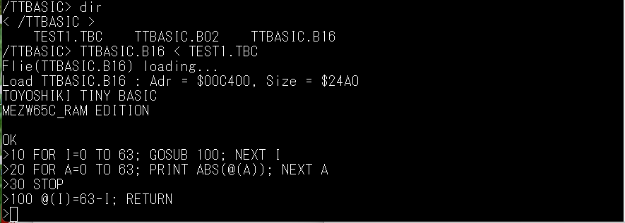
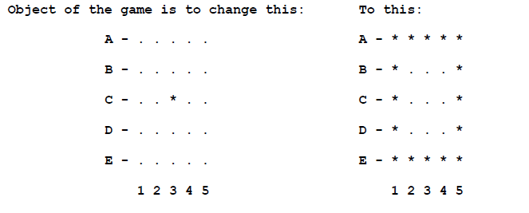

# 豊四季タイニーBASIC

豊四季タイニーBASICは、「タイニーBASICをCで書く」の著者である鈴木哲哉さんがC言語で作成された、TinyBASICです。 
以前、SBCV20/8088ボードに移植したものを、MEZW65C_RAMで動作するようにしました。 
エミュレーションモードと、ネイティブモードで動作するバイナリを用意しました。 
サンプルプログラムとして、Hit and Blow（3桁の数当てゲーム）と、
[VTL2リファレンスマニュアル](https://github.com/akih-san/MEZW65C_RAM-Rev2.0/blob/main/vtl2/Altair_680-VTL-2%20Manual-05-Beta_1-Searchable.pdf)
に載っていた 
STARSHOOTERを添付しました。  
- Hit and Blow（3桁の数当てゲーム）  
  このゲームのオリジナルソースは、[@iiguraさん](https://qiita.com/iigura)の[397 行で tiny basic のインタプリタを作る](https://qiita.com/iigura/items/3cad19fd38def582c342)
  から、拝借し、 豊四季タイニーBASIC用にアレンジしました。  

- STARSHOOTER  
  豊四季タイニーBASICは、数字しか入力できないので、VTLのオリジナルと入力方法が異なります。 
  ５×５のマスの中に星（＊）が「33」にあります。これに星をぶつける（「33」と入力）と 
  爆発して、四方に飛び散ります。飛び散った先に星があればぶつかって消滅するといったゲームです。 
  最終的に、下記のようにマスの淵に星を並べることが求められていますが、ゲームの終了判定はして 
  いないので、終了は99を入力します。単純ですが、結構ハマります（笑）。 
  [VTL2](https://github.com/akih-san/MEZW65C_RAM-Rev2.0/blob/main/vtl2/STAR_SHT.VTL)と
  [ttbasic](https://github.com/akih-san/MEZW65C_RAM-Rev2.0/blob/main/ttbasic/STR_SHTR.TBC)のプログラムを見比べて、
  処理系の違いを理解するのも一考かもしれませんね。  
    
    

[SBCV20_8088版豊四季タイニーBASIC](https://github.com/akih-san/SBCV20_8088)

タイニーBASICについては、以下のサイトをご覧になってください。

[命名-豊四季タイニーBASIC](https://vintagechips.wordpress.com/2012/06/10/%e5%91%bd%e5%90%8d-%e8%b1%8a%e5%9b%9b%e5%ad%a3%e3%82%bf%e3%82%a4%e3%83%8b%e3%83%bcbasic/)

[豊四季タイニーBASICの文法](https://vintagechips.wordpress.com/2015/12/08/%E8%B1%8A%E5%9B%9B%E5%AD%A3%E3%82%BF%E3%82%A4%E3%83%8B%E3%83%BCbasic%E3%81%AE%E6%96%87%E6%B3%95/)

[豊四季タイニーBASIC確定版](https://vintagechips.wordpress.com/2015/12/06/%e8%b1%8a%e5%9b%9b%e5%ad%a3%e3%82%bf%e3%82%a4%e3%83%8b%e3%83%bcbasic%e7%a2%ba%e5%ae%9a%e7%89%88/)

[タイニーBASICをCで書く](https://www.amazon.co.jp/%E3%82%BF%E3%82%A4%E3%83%8B%E3%83%BCBASIC%E3%82%92C%E3%81%A7%E6%9B%B8%E3%81%8F-%E9%88%B4%E6%9C%A8-%E5%93%B2%E5%93%89/dp/4802610203)
