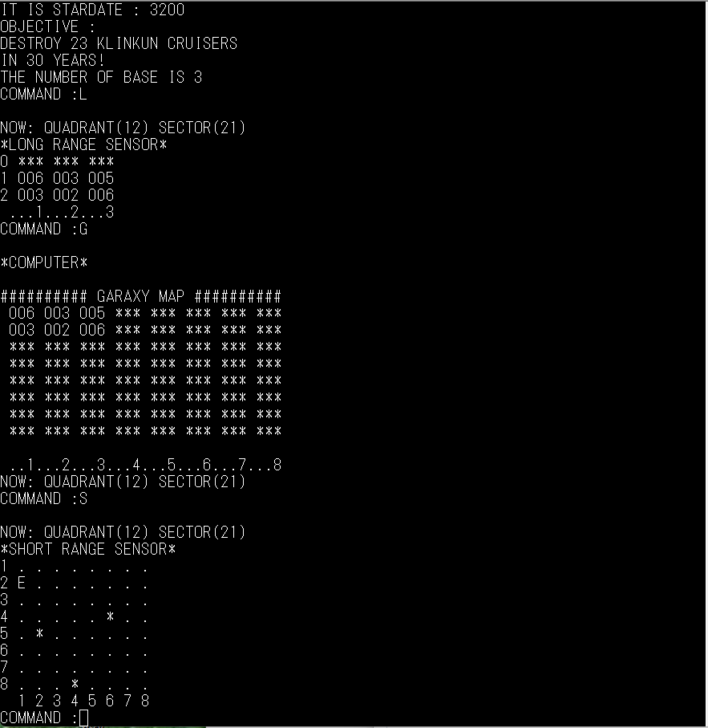

# VTL2について
 
著者である電脳伝説さんの「モトローラ6800伝説　第二章　Chapter3プログラムの再現」 
でVTLが紹介されていますが、とてもコンパクトなインタプリタです。 
 
また、T. Nakagawa氏がWeb、「VTL(Very Tiny Language)の作成」にてＣ言語で書かれた 
VTL-Cを公開されています。 
VTLの基本的なことや、インプリメント方法が載っていますので、是非ご覧ください。 
W65C816ネイティブモード用として、T. Nakagawa氏のVTL-Cをポーティングしました。 
- [VTL(Very Tiny Language)の作成](http://middleriver.chagasi.com/electronics/vtl.html) 
 
6502.orgでVTL02のソースコードが公開されていましたので、W65C02用にポーティングしました。 
 

- [VTL02](http://6502.org/source/interpreters/vtl02.htm)
  VTL2のマニュアルを添付してあります。その中から、２つサンプルプログラムを添付しました。
  - STARSHOOTER（STAR_SHT.VTL)  
    ５×５のマスの中に星（＊）が「C-3」にあります。これに星をぶつける（「C3」と入力）と 
    爆発して、四方に飛び散ります。飛び散った先に星があればぶつかって消滅するといったゲームです。 
    最終的に、下記のようにマスの淵に星を並べることが求められていますが、ゲームの終了判定はして 
    いないので、終了はCtrl+Cで行います。単純ですが、結構ハマります（笑）。  
    
    
    このゲームは、メモリ上に配列を取っていますが、配列の境界チェックは行っていないので、キー入力を 
    し続けると、メモリをどんどん壊していくバグがあります。 
    290行目の処理が「_」を入力すると、キーバッファポインタがデクリメントされるので、恐らくＢＳキーの 
    処理だと思います。これを実行し続けると、やがてスタックや、ゼロページを破壊して暴走しますので、 
    注意が必要です。 
    あえて、このバグは修正していないので、VTL2の勉強材料として修正してみてください。  
    
  - PHRASE SORT (P_SORT.VTL)  
    入力した文字列をソートするプログラムです。プログラムを開始すると、キー入力待ちになります。 
    適当に好きなキー入力を行ってリターンキーを押すと、ソートが開始され、結果が表示されます。 
 
また、シロピョン氏のページ「超ミニ言語で遊ぼう（４）みんなで「スタ☆トレ」」で 
ＭＳＸ版のＶＴＬで「STAR TREK」を紹介しています。 
 
今回、サンプルとして、スタ☆トレを拝借しています。MSX版をそのまま動かすと、 
ショートレンジセンサーが文字化けするので、その部分を修正してあります。 
 

- [超ミニ言語で遊ぼう（４）みんなで「スタ☆トレ」](https://ameblo.jp/siropyon/entry-11917965564.html) 

